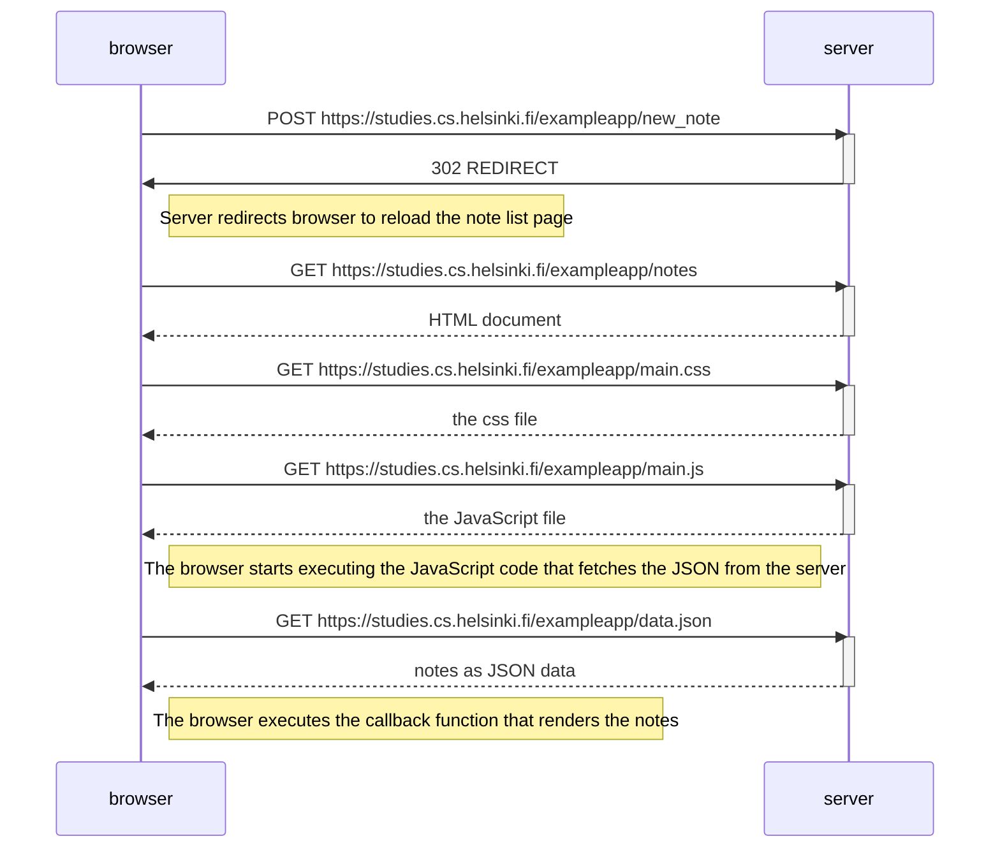
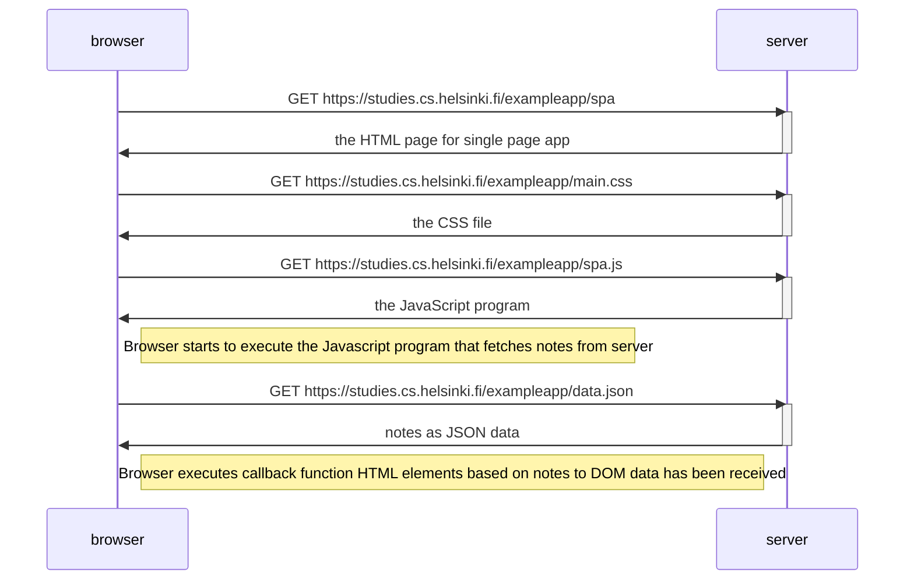
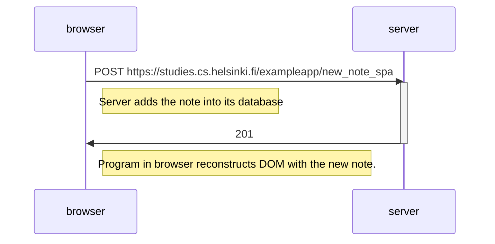

# Tehtävä 0.4

Creating new note in traditional web app

```mermaid

sequenceDiagram
    participant browser
    participant server


    browser ->> server: POST https://studies.cs.helsinki.fi/exampleapp/new_note
    activate server
    server ->> browser: 302 REDIRECT
    deactivate server

    note right of browser: Server redirects browser to reload the note list page

    browser->>server: GET https://studies.cs.helsinki.fi/exampleapp/notes
    activate server
    server-->>browser: HTML document
    deactivate server
    
    browser->>server: GET https://studies.cs.helsinki.fi/exampleapp/main.css
    activate server
    server-->>browser: the css file
    deactivate server
    
    browser->>server: GET https://studies.cs.helsinki.fi/exampleapp/main.js
    activate server
    server-->>browser: the JavaScript file
    deactivate server
    
    Note right of browser: The browser starts executing the JavaScript code that fetches the JSON from the server
    
    browser->>server: GET https://studies.cs.helsinki.fi/exampleapp/data.json
    activate server
    server-->>browser: notes as JSON data
    deactivate server    

    Note right of browser: The browser executes the callback function that renders the notes 

```

# Tehtävä 0.5

Loading the SPA app

```mermaid
sequenceDiagram
    participant browser
    participant server

    browser ->> server: GET https://studies.cs.helsinki.fi/exampleapp/spa
    activate server
    server ->> browser: the HTML page for single page app
    deactivate server

    browser ->> server: GET https://studies.cs.helsinki.fi/exampleapp/main.css
    activate server
    server ->> browser: the CSS file
    deactivate server


    browser ->> server: GET https://studies.cs.helsinki.fi/exampleapp/spa.js
    activate server
    server ->> browser: the JavaScript program
    deactivate server

    note right of browser: Browser starts to execute the Javascript program that fetches notes from server   

    browser ->> server: GET https://studies.cs.helsinki.fi/exampleapp/data.json
    activate server
    server ->> browser: notes as JSON data
    deactivate server

    note right of browser: Browser executes callback function HTML elements based on notes to DOM data has been received

```

# Tehtävä 0.6

Creating a new hote in SPA app

```mermaid
sequenceDiagram
    participant browser
    participant server

    browser ->> server: POST https://studies.cs.helsinki.fi/exampleapp/new_note_spa
    activate server

    note right of browser: Server adds the note into its database
    server ->> browser: 201
    deactivate server

    note right of browser: Program in browser reconstructs DOM with the new note.  
    
```